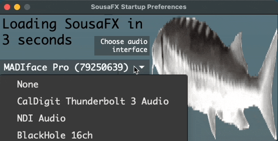

    

  

# :studio_microphone: Introduction

Thanks for checking out SousaFX! Designed primarily for tuba players, SousaFX is a multi-effects rig that lets you control audio effects with a game controller attached to the side of a tuba.

SousaFX can run either on its own, or alongside Ableton Live to utilize drum loops, backing tracks, networked jamming plugins, etc. A "SousaPlayback template Project" for Live is provided.

  

# :gear: Hardware Requirements

1. mac or windows computer

1. game controller

1. USB audio interface

1. XLR microphone, or Yamaha SilentBrass™ mute & PersonalStudio™

1. headphones, in-ear monitors, or loudspeaker

1. a tuba

  

# :floppy_disk: Software Installation

1. [Download Max](https://cycling74.com/downloads) from Cycling '74.

> [!NOTE]
> SousaFX remains fully operational after Max's 30-day trial ends.

2. [Download sousastep](https://github.com/Sousastep/sousastep/releases/latest) to your `~/Documents/Max 8/Projects/` folder. 

> [!NOTE]
> Optionally, for thoughtful quotes whenever SousaFX boots, download [oblique-strategies](https://github.com/zzkt/oblique-strategies) to `~/Documents/Max 8/Projects/sousastep/default/`

> [!IMPORTANT]
> When updating to new versions of SousaFX, copy all user preset files from `~/Documents/Max 8/Projects/sousastep/SousaFX/data/` to the new version's `sousastep/SousaFX/data/` folder.

  

# :steam_locomotive: Startup

1. Open `~/Documents/Max 8/Projects/sousastep/SousaFX/SousaFX.maxproj`. SousaFX's Startup Preferences window will appear. Select your preferred audio interface, then uncheck the pause button. SousaFX will load momentarily.

  

> [!NOTE]
> The rig choices include SousaFX, which is the main rig, BasicFX, which is just a compressor and distortion effect, and VFX, which you'll only need if you've followed my tutorial on [how to build an LED sousaphone bell](https://jbaylies.github.io/Electrobrass_Encyclopedia/en/master/content/tutorials/LED-sousa-bell.html).

  

# :sound: SousaFX

2. After SousaFX's Startup Preferences loads the rig, in the menu bar, under SousaFX, click Controller Bindings.

  

# :joystick: Controller Bindings

Here you can see everything the controller's attached to.

If you have a controller with an LED like the PS4 controller, the LED color can be controlled by the tuba's envelope or LFO. 

  

