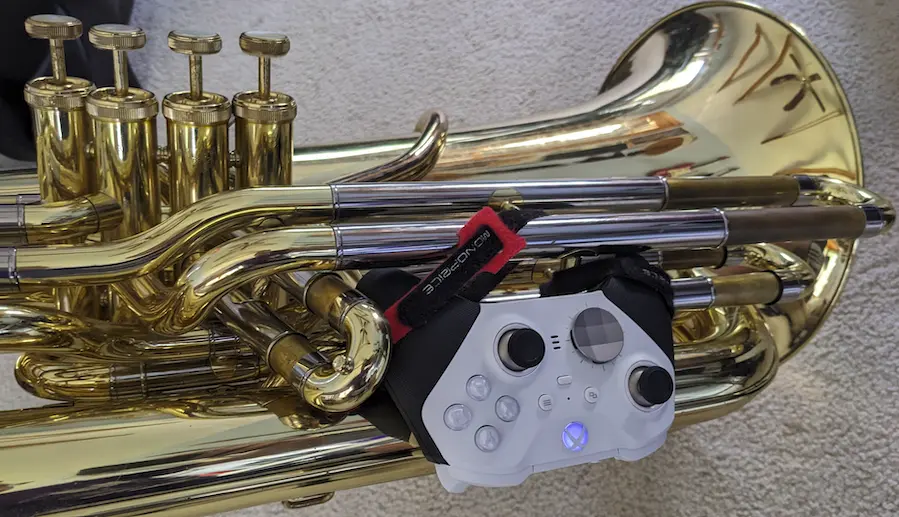

    

# :studio_microphone: Introduction

SousaFX is a multi-effects rig made with [MaxMSP](https://cycling74.com/products/max) that lets tuba players control audio effects using a game controller attached to the side of the tuba.

It features a number of [audio effects](https://sousastep.github.io/SousaFX-docs/content/fx.html#audio-effects), thoughtfully refined so that modulating their parameters with a game controller is as musical as possible. A [controller bindings page](https://sousastep.github.io/SousaFX-docs/content/bindings.html#controller-bindings) allows you to remap controls and set [deadzones](https://sousastep.github.io/SousaFX-docs/content/deadzones.html#deadzones), and the bindings can also be relinquished and established [on-the-fly](https://sousastep.github.io/SousaFX-docs/content/pcl.html#parameter-control-logic), based on looper status, joystick positioning, and wether or not the tuba’s playing.

SousaFX can run either on its own, or alongside Ableton Live to utilize drum loops, backing tracks, networked jamming plugins, etc. A [SousaPlayback template Project](https://sousastep.github.io/SousaFX-docs/content/playback.html#sousaplaybacktemplate) for Live is provided.

Five audio-rate control signal outputs let SousaFX send LFO and envelope data to VFX apps such as [SousaVFX](https://sousastep.github.io/SousaFX-docs/content/sousavfx.html), VDMX, Resolume, Touchdesigner, etc.

SousaFX may be [downloaded](https://sousastep.github.io/SousaFX-docs/content/install.html#installation) and evaluated for free, however a license must be [purchased](https://sousastep.github.io/SousaFX-docs/content/purchase.html#purchase) for continued use.

> [!NOTE]  
> The next release may be the last as development switches over to [SousaFX-rnbo](https://github.com/Sousastep/SousaFX-rnbo)

# :books: Documentation

To learn more about SousaFX, check out the [documentation](https://sousastep.github.io/SousaFX-docs/index.html).

