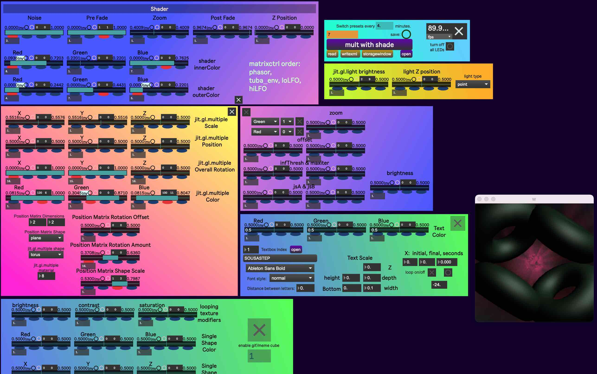
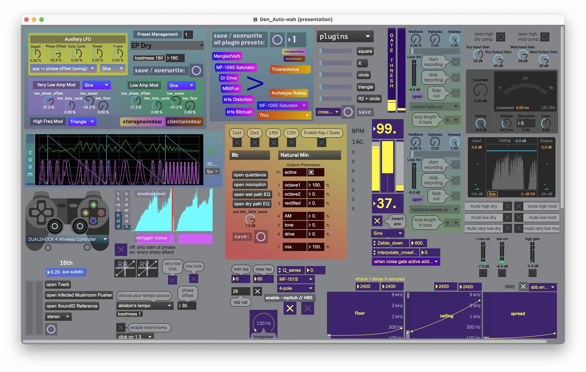
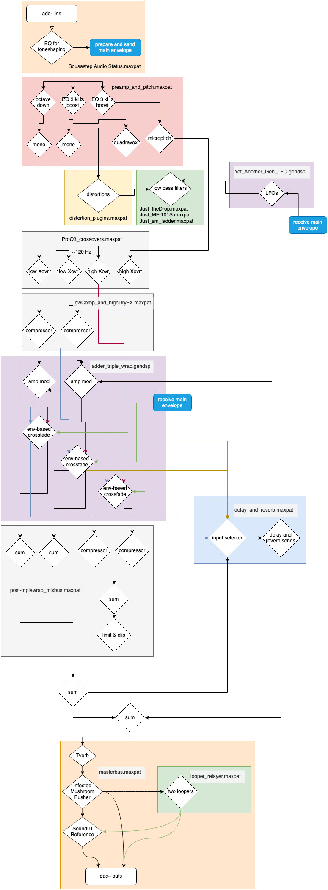

# max patch pics

# signal flow diagram

# PS4 controller mappings

## square, x, circle, triangle

Pressing `square`, `x`, or `triangle` engages delay sends. 
These sends can be locked open by holding `R1`, `R2`, or `L2` while releasing `square`, `x`, `circle`, or `triangle`.

- □ dotted quarter delay
- x ultratap delay
- ○ dotted eighth delay
- △ tap tempo

Holding down `R1`, `R2`, or `L2` changes the function of `square`, `x`, `circle`, and `triangle`.

- R1: main pattr preset selectors
    - □ preset #1
    - x preset #2
    - ○ preset #13
    - △ preset #14

- R2
    - □ toggle LFO and metronome between "regular rhythm" and [Risset rhythm](https://github.com/jbaylies/risset-rhythm-metro-and-wah).
    - x whole note delay send
    - ○ reverb send. can be held open by releasing `R2` before releasing `circle`
    - △ toggle metronome on/off

- L2
    - □ looper 1 control
        - single click: start recording
        - double click: stop recording
        - hold: fade out

    - x looper 2 control
        - single click: start recording
        - double click: stop recording
        - hold: fade out

    - ○ nothin

    - △ controls Ableton Live's [scene selection](https://www.ableton.com/en/manual/midi-and-key-remote-control/#relative-session-view-navigation)
        - single click: launch scene
        - double click: down one scene
        - hold: up three scenes

## d-pad

The d-pad and L1 sets subdivisions of the LFO. 
Holding L2 changes the values of the d-pad and L1. 
Certain selections set the swing length to either half or quarter.
Dotted rhythms and slow triplet rhythms reset their phase on the bar after being pressed. (it'd be better if they reset a quarter note after being pressed)

- L1:            quarter triplet (sets swing length to half)
- up:            quarter (sets swing length to half)
- up-left:       eighth quintuplet
- left:          eighth (sets swing length to quarter)
- down-left:     32nd (bit too fast, maybe replace with dotted quarter)
- down:          16th (sets swing length to quarter)
- down-right:    16th triplet
- right:         eighth triplet (sets swing length to quarter)
- up-right:      dotted eighth

With L2:

- L1:            half
- up:            quarter quintuplet
- left:          eighth quintuplet
- down:          32nd quintuplet (also too fast)
- right:         16th quintuplet

The phase of the LFO can be inverted in two ways:

1. by pressing any d-pad button or L1 a second time.
2. by pressing the `share` button.

## joysticks

### Left Vertical
Adjusts the transient crossfade's ceiling and floor upwards and downwards 
as a method of adjusting the mix between the dry tuba sound and the dubstep effect.

### Left Horizontal
Holding L3 for half a sec switches LH 
from adjusting the duty cycle, phase, and pow of the lowpass freq mod LFO, 
to adjusting the shape of the envelope for the ceiling of the lowpass freq mod LFO.
These adjustments can be locked in place by holding L3, and unlocked by double-clicking L3.
Additionally, while the tuba's not playing, 
LH controls a bandpass filter frequency and mix for the drum loops in Live. 

### Right Vertical
Downwards crossfades from sync LFO to free rate LFO
Upwards increases the amount of swing

### Right Horizontal
Left speeds up free rate LFO, right slows down free rate LFO.
Left increases resonance of lowpass filter. Right decreases resonance.
Resonance can be locked in place by pressing R3, and unlocked by holding R3.
While resonance is locked, RH adjusts Ableton Live's crossfade, 
which is set to fade between drum loops.
(The `options` button mutes drum loops while held)

